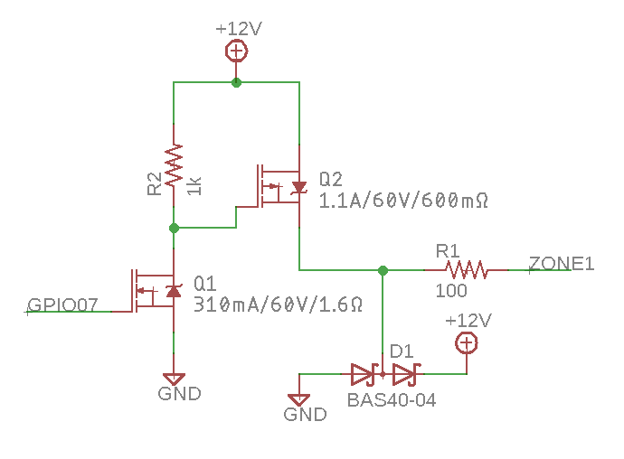
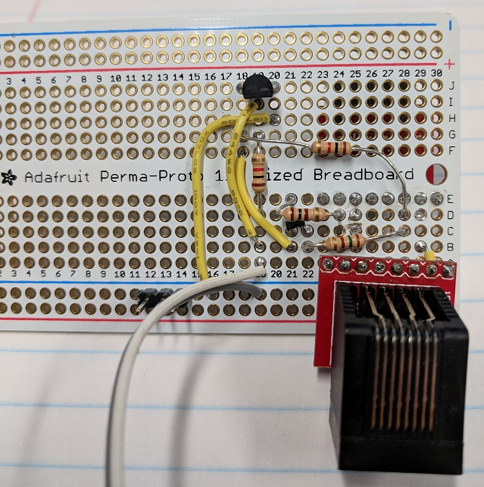

# elancontrol
### Code to control an Elan System6 Integrated Multi-Zone Controller from RaspberryPi

Hardware:

- [x] Reverse Engineer IR Control Protocol
- [x] Create Function to Replicate IR Control on RaspPi GPIO
- [x] Design Electrical Level Shifter for IR Protocol
- [x] Write UDP server that listens for commands and sends via GPIO
- [x] Verify GPIOs can be used on Pi2
- [x] Verify RS-485 identical on all 6 zones.
- [x] Design RaspPi "Hat" PCB with 6 x Level Shifters and 1 x RS-485
- [x] Test RaspPi "Hat"

Software:

- [ ] Interface Node.js to bit banging C software via N-API
- [ ]  Node.js server via Websockets
- [ ] Webpage GUI with Websockets interface to the Node.js backend
- [ ] Reverse Engineer RS-485 based Status Protocol to display current state

## Current Status
Have the command protocol generated from command line program, tested and works with hand-build level shifter.  PCB version is tested and works from the command line bit banging software (send_zpad_command_CLI) for all 6 zones.

## General Info
I have a Elan S6 in my house and I love it, if only I could control it via my phone!  It shouldn't be that hard to get a Pi connected!

## Inital Feasibility
This inital goal is to have a Raspberry inject IR commands from a bit banged GPIO.  I'm going to capture the commands from the Zpad, and see if a Pi can bit bang fast enough to replicate them.  Unfortunatly, it looks like pin#2 uses an open collector pull up to 12V.  We will need a level shifter and a PMOS pull-up.  I will build a level shifter, and test if we can command the S6

Looking at the commands, they consist of 12 x 12.5 us wide 12V high puleses, with either 5.07 ms spacing (short) or 7.6 ms of spacing (long).
The first 6 pulses seem to be a preamble, always spaced short, then the next 6 with either long or short:

Decoding of the Key Commands (Preamble Omitted):

| Command  | Code | Bin | Dec |
| :------: |:----:|:---:|:---:|
| Off | SSSSSS | 000000 | 0 |
| Mute | SSSSLS | 000010 | 2 |
| VolUp | SSSLSS | 000100 | 4 |
| VolDown | LSSLSS | 100100 | 36 |
| 2ndRowRight | LSLSSS | 101000 | 40 |
| 2ndRowCenter | SSLLSS | 001100 | 12 |
| 2ndRowLeft | SSLSLL | 001011 | 11 |
| UpperRight | SSLSLS | 001010 | 10 |
| UpperCenter | SSLSSL | 001001 | 9 |
| UpperLeft | SSLSSS | 001000 | 8 |

## Level Shifter

Circuit takes the 3.3V GPIO from the Pi, and performes a open-collector pull-up.  The S6 seems to have an internal 1k pull-down to ground.  Looking at the Zpads, they have an open-collector pull-up with a ~100 ohm resistor to current limit.  Added a dual diode for over-voltage protection (The Zpads have diode protection as well).

I also prototyped it with some components I had laying around:

## PCB

Trusty old Macrofab to the rescue.  $50 and a few weeks and I got this:

Known issues:  The bottom row of Cat5 Is hard to get out, as the Cat5 connectors are supposed to hang off the edge of the PCB.  This would make the PCB huge, if I'm still trying to use all 4 mounting holes.  No good way to solve this.  Need a very high [Rasperry Pi connector](https://www.amazon.com/gp/product/B0756KM3GB/ref=oh_aui_search_detailpage?ie=UTF8&psc=1) to clear (this one is barley tall enough).
