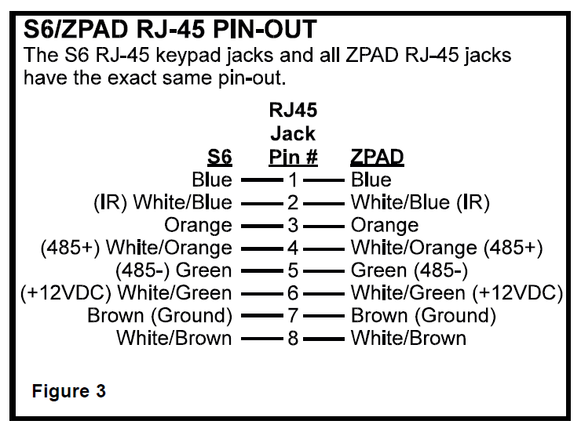
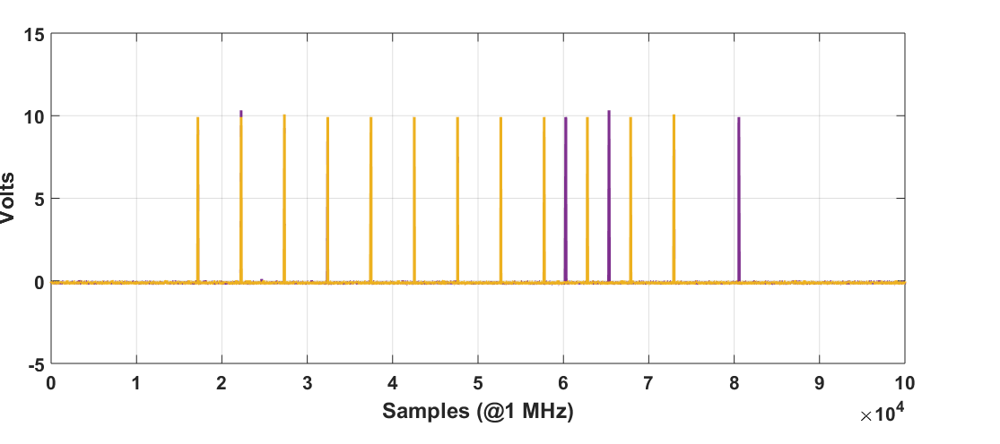

# elancontrol
### Code to control an Elan System6 Integrated Multi-Zone Controller from RaspberryPi

- [x] Reverse Engineer IR Control Protocol
- [x] Create Function to Replicate IR Control on RaspPi GPIO
- [x] Design Electrical Level Shifter for IR Protocol
- [ ] Reverse Engineer RS-485 based Status Protocol
- [ ] Design RaspPi "Hat" PCB with 6XIR and 1xRS-485

## Current Status
Have the command protocol generated from command line program, tested and works with hand-build level shifter.

## General Info
I have a Elan S6 in my house and I love it, if only I could control it via my phone!  It shouldn't be that hard to get a Pi connected!

From some experimentation and manual reading, the S6 receives commands from the Zpads on pin #2 (IR) (Note that Elan’s pin numbering is backwards from the ANSI/TIA-568 standards).  

## Inital Feasibility
This inital goal is to have a Raspberry inject IR commands from a bit banged GPIO.  I'm going to capture the commands from the Zpad, and see if a Pi can bit bang fast enough to replicate them.  Unfortunatly, it looks like pin#2 uses an open collector pull up to 12V.  We will need a level shifter and a PMOS pull-up.  I will build a level shifter, and test if we can command the S6

Looking at the commands, they consist of 12 x 12.5 us wide 12V high puleses, with either 5.07 ms spacing (short) or 7.6 ms of spacing (long).
The first 6 pulses seem to be a preamble, always spaced short, then the next 6 with either long or short:

Decoding of the Key Commands (Preamble Omitted):

| Command  | Code | Bin | Dec |
| :------: |:----:|:---:|:---:|
| Off | SSSSSS | 000000 | 0 |
| Mute | SSSSLS | 000010 | 2 |
| VolUp | SSSLSS | 000100 | 4 |
| VolDown | LSSLSS | 100100 | 36 |
| 2ndRowRight | LSLSSS | 101000 | 40 |
| 2ndRowCenter | SSLLSS | 001100 | 12 |
| 2ndRowLeft | SSLSLL | 001011 | 11 |
| UpperRight | SSLSLS | 001010 | 10 |
| UpperCenter | SSLSSL | 001001 | 9 |
| UpperLeft | SSLSSS | 001000 | 8 |

